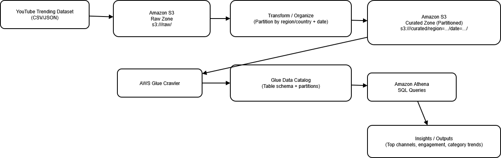
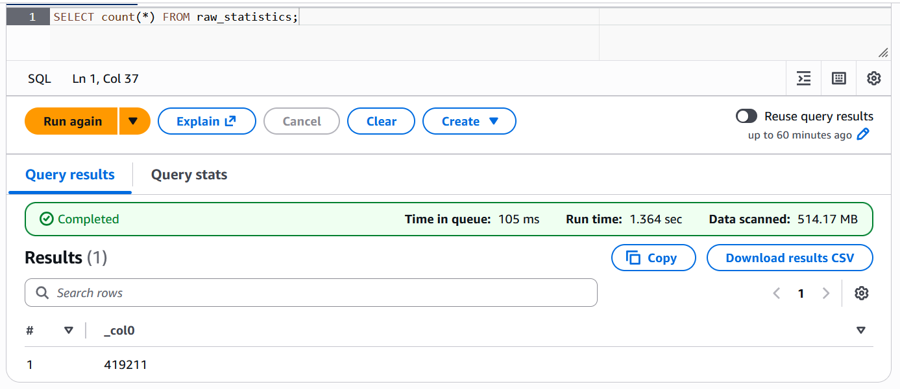
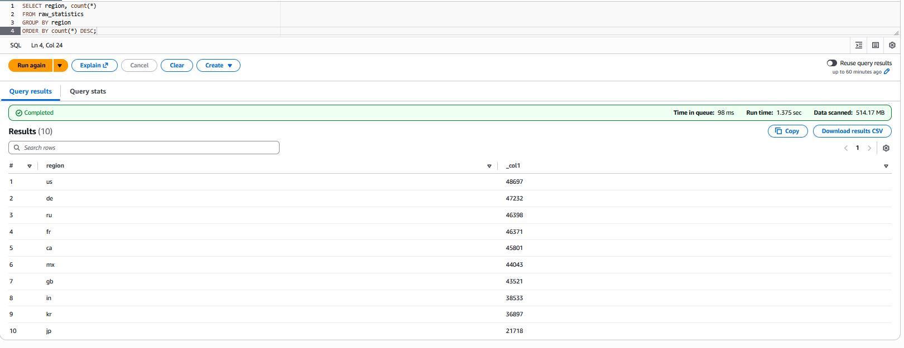
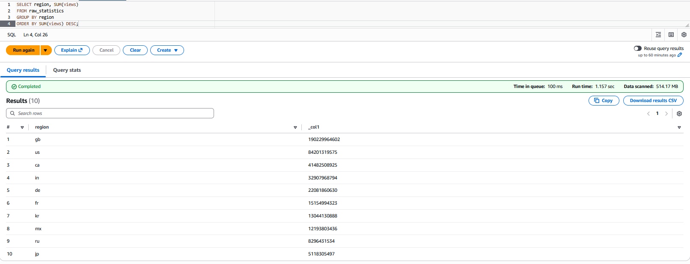
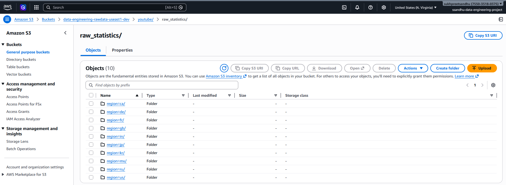

# YouTube Trending Data Lake (AWS)


## Project Overview

This project implements a fully serverless data lake architecture on AWS to analyze YouTube trending video data across multiple countries.

The system ingests raw CSV files, stores them in Amazon S3 using partitioned folders (`region=xx` format), automatically discovers schema using AWS Glue Crawlers, and enables SQL-based analytics using Amazon Athena.

The entire pipeline operates without provisioning or managing servers.

---

## Architecture



---

## Project Structure

```
youtube-trending-data-lake-aws/
│
├── data/
│   └── raw/                    # Original dataset files used for upload
│
├── docs/
│   ├── architecture.png        # System architecture diagram
│   └── screenshots/            # Evidence screenshots from AWS
│       ├── athena-row-count.png
│       ├── athena-record-count-by-region.png
│       ├── athena-total-views-by-region.png
│       └── s3-partitioned-regions.png
│
├── queries/
│   └── athena_queries.sql      # Example SQL queries used for analysis
│
└── README.md
```
---

## AWS Services Used

- **Amazon S3** – Data lake storage
- **AWS Glue Crawler** – Automated schema discovery
- **Glue Data Catalog** – Centralized metadata management
- **Amazon Athena** – Serverless SQL analytics
- **IAM** – Access control and permissions

---

## Data Structure

Data is stored in S3 using partitioned folders:

```
youtube/raw_statistics/
    region=us/
    region=gb/
    region=ca/
    region=de/
    region=fr/
    ...
```

This partitioned structure enables **partition pruning** in Athena, reducing query scan size and improving performance.

- Total records processed: **419,211+**
- Full-table scan size: **~514 MB**
- Countries included: **10**

---

## How to Reproduce This Project

### Prerequisites

- AWS account
- IAM user with access to S3, Glue, Athena
- AWS CLI configured (optional but recommended)

---

### 1. Clone the Repository

```bash
git clone https://github.com/sandhu-sukhpreet/youtube-trending-data-lake-aws.git
cd youtube-trending-data-lake-aws
```

---

### 2. Create an S3 Bucket

Create a new S3 bucket (example name):

```
youtube-data-lake-<your-name>
```

---

### 3. Upload Raw Dataset to S3

Upload data into partitioned folders:

```
youtube/raw_statistics/region=us/
youtube/raw_statistics/region=gb/
youtube/raw_statistics/region=ca/
...
```

Using AWS CLI:

```bash
aws s3 cp ./data/ s3://youtube-data-lake-<your-name>/youtube/raw_statistics/ --recursive
```

---

### 4. Create AWS Glue Crawler

1. Go to AWS Glue → Crawlers → Create Crawler
2. Data source: S3
3. Path: `s3://youtube-data-lake-<your-name>/youtube/raw_statistics/`
4. Output database: create new database (e.g., `youtube_db`)
5. Run crawler

The crawler creates a table (`raw_statistics`) in the Glue Data Catalog.

---

### 5. Query Using Amazon Athena

1. Open Amazon Athena
2. Select database: `youtube_db`
3. Run SQL queries

---

## Example Athena Queries

### 1. Total Record Count

```sql
SELECT COUNT(*) 
FROM raw_statistics;
```

---

### 2. Record Count by Region

```sql
SELECT region, COUNT(*)
FROM raw_statistics
GROUP BY region
ORDER BY COUNT(*) DESC;
```

---

### 3. Total Views by Region

```sql
SELECT region, SUM(views)
FROM raw_statistics
GROUP BY region
ORDER BY SUM(views) DESC;
```

---


## Evidence

### Total Row Count


### Record Count by Region


### Total Views by Region


### S3 Partitioned Structure


---


## Athena Performance Metrics

| Query | Data Scanned | Runtime |
|--------|-------------|---------|
| Total Record Count | 514.17 MB | 1.36 sec |
| Record Count by Region | 514.17 MB | 1.37 sec |
| Total Views by Region | 514.17 MB | 1.15 sec |

**Observation:**  
Queries without partition filters scan the entire dataset (~514 MB).  
Adding a filter such as `WHERE region = 'CA'` significantly reduces data scanned through partition pruning.

---


## Key Highlights

- 419,000+ records analyzed
- 10-country partitioned dataset
- Fully serverless AWS architecture
- Automated schema detection with Glue
- Partitioned S3 design for scalable analytics
- SQL-based insights using Amazon Athena

---


## Lessons Learned

- Proper S3 partitioning (`region=xx`) enables efficient partition pruning in Athena.
- Athena query cost is directly tied to data scanned.
- Consistent folder structure is critical for Glue Crawler schema detection.
- Even serverless architectures require thoughtful data layout design for performance optimization.
- Clear documentation significantly improves project reproducibility and portfolio impact.

---
